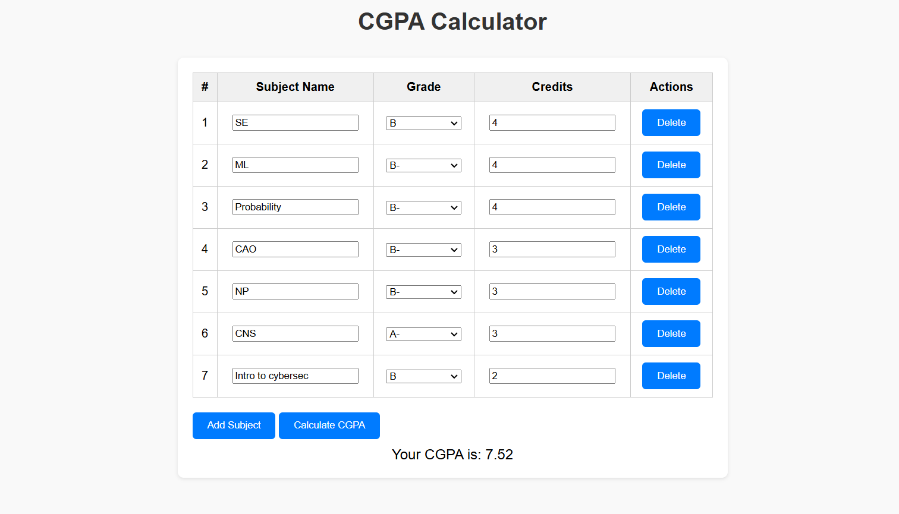

# CGPA Calculator 🎓

A simple, interactive, and visually appealing CGPA calculator built with **HTML**, **CSS**, and **JavaScript**.  
This project allows users to calculate their CGPA by entering subject details, grades, and credits. It features an attractive UI with dynamic functionality for adding and deleting subjects.

## Features 🚀
- **Dynamic Table**: Add, delete, and edit subjects with ease.
- **Grade Dropdown**: Select grades from a pre-defined dropdown menu for better usability.
- **Responsive Design**: Works seamlessly on desktops and mobile devices.
- **Automatic Calculations**: Computes CGPA instantly with a click.
- **Attractive UI**: Modern design with gradient backgrounds and smooth hover effects.

## How to Use 📖
1. Clone this repository or download the file.
2. Open the `index.html` file in any modern web browser.
3. Add subject details:
   - Subject Name
   - Grade (Select from the dropdown: A, A-, B, etc.)
   - Credits
4. Click **"Add Subject"** to add more rows.
5. Click **"Calculate CGPA"** to see the result.
6. To remove a subject, click the **"Delete"** button next to it.

## Grade-to-Point Mapping 🧮
| Grade | Points |
|-------|--------|
| A     | 10     |
| A-    | 9      |
| B     | 8      |
| B-    | 7      |
| C     | 6      |
| E     | 2      |
| F     | 0      |

## Screenshots 📸

## Contribution 🤝
Contributions are always welcome! If you have ideas for improvements, feel free to:
- Fork the repository.
- Create a feature branch (`git checkout -b feature/YourFeature`).
- Commit your changes (`git commit -m 'Add some feature'`).
- Push to the branch (`git push origin feature/YourFeature`).
- Open a Pull Request.

## Acknowledgments 💡
- Inspired by the need for a simple yet effective CGPA calculator.
- Built with 💖 and JavaScript!

---

Feel free to reach out for feedback or feature requests!

